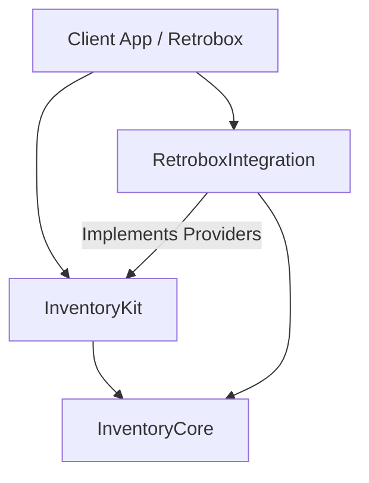

# InventoryKit Architecture

## Overview
`InventoryKit` is the central service for managing digital asset inventories. It handles two distinct but related domains:
1.  **User Inventory**: Private, user-specific assets (e.g., "My version of Lode Runner on my floppy disk").
2.  **Product Catalog**: Public, shared authority records (e.g., "Lode Runner published by Broderbund in 1983").

## Protocol-First Design

InventoryKit uses a **Protocol-First Design** to support various persistence backends (SwiftData, CoreData, CloudKit, Files) while maintaining a strict shared domain model.

### 1. Domain Protocols (InventoryCore)
These protocols define the "shape" of data without mandating a specific implementation (struct vs class).

*   **`InventoryAssetProtocol`**: Defines a user asset.
    *   **Usage**: Implemented by `InventoryAsset` (struct) for internal logic/transfer.
    *   **Persistence**: Implemented by `InventoryAssetEntity` (SwiftData Class) or `CKRecord` wrappers (CloudKit) in client apps.
*   **`InventoryProductProtocol`**: Defines a catalog product (authority record).
    *   **Usage**: Implemented by `InventoryProduct` (struct) for API responses/local processing.
    *   **Persistence**: Implemented by `ProductEntity` (SwiftData Class) for local caching.

### 2. Concrete Models (InventoryCore)
Standard `struct` implementations of the protocols. These are `Sendable`, `Codable`, and value types.
*   **`InventoryAsset`**: The standard value type for passing asset data around securely across concurrency boundaries.
*   **`InventoryProduct`**: The standard value type for catalog data.
*   **`InventoryCatalogVendor`**: The standard value type for vendor data.

### 3. Service Layer (InventoryKit)
The service layer operates primarily on **Protocols** or standard **Structs** to remain agnostic of the underlying database technology.

*   **`InventoryService`**: The main entry point actor.
    *   Accepts storage providers that return `InventoryAssetProtocol` or `InventoryProductProtocol`.
    *   Converts between database entities and standard structs when necessary (e.g., for "Safe" data transfer).

## Storage Providers
The storage layer pattern allows the database implementation to live **outside** InventoryKit (e.g., in `RetroboxIntegration`).

### Provider Protocols
*   **`InventoryStorageProvider`**:
    *   Methods: `loadInventory(...) -> InventoryDocument`, `saveInventory(...)`
    *   The provider is responsible for mapping its internal database rows/records to `InventoryKit` types.
*   **`InventoryCatalogStorageProvider`**:
    *   Methods: `createProduct(_ product: any InventoryProductProtocol)`, `getProduct(id: UUID) -> (any InventoryProductProtocol)?`
    *   Allows `Inverse Dependency`: InventoryKit depends on the *protocol*, while the App (`Retrobox`) provides the *implementation* (e.g., `SwiftDataInventoryStorageProvider`).

## Persistence Strategy

### SwiftData Integration (Retrobox)
*   **Client**: `RetroboxIntegration`
*   **Models**: `AssetEntity` (Class), `ProductEntity` (Class).
*   **Conformance**: These classes conform to `InventoryAssetProtocol` and `InventoryProductProtocol`.
*   **Provider**: `SwiftDataInventoryStorageProvider` implements `InventoryStorageProvider`.
    *   Fetches `AssetEntity` objects.
    *   Returns them as `any InventoryAssetProtocol` (or maps them to `InventoryAsset` structs).

### CloudKit Integration
*   **Models**: `CKRecord`.
*   **Adapter**: A light wrapper struct `CloudKitAsset: InventoryAssetProtocol` that reads/writes to the underlying `CKRecord`.

## Module Graph

