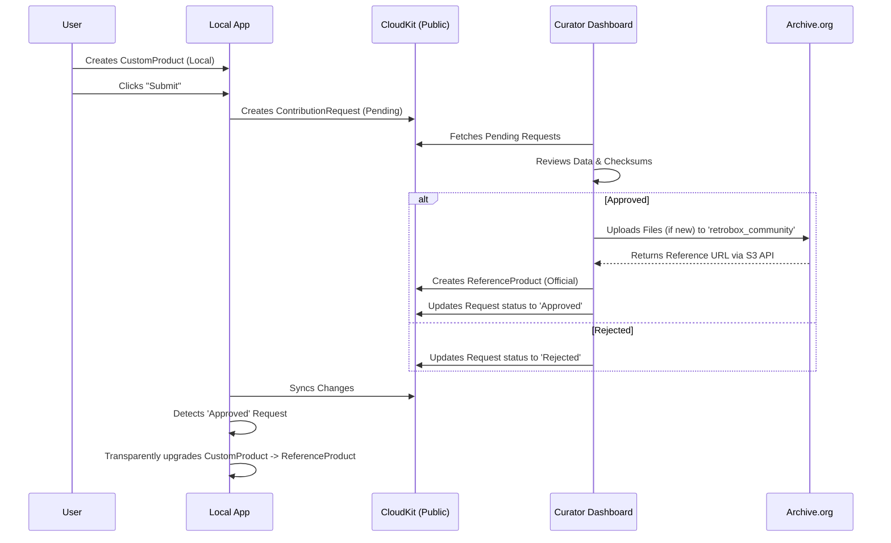

# Submission Design & Contribution Workflow

**Status**: Draft / Discussion
**Topic**: User Contributions to the Public Reference Catalog (Retrobox)

## 1. Overview
The goal is to allow users to contribute missing data (software titles, hardware specs) to the public domain while maintaining high data quality and preventing vandalism. The system follows a **"Local-First, Verify-Later"** philosophy.

## 2. Core Philosophy
1.  **Immediate Utility**: Users shouldn't wait for approval to use their data. They define "Custom" items locally and use them instantly.
2.  **Gatekeeper Security**: The public catalog is "World-Readable, Admin-Writable". Users cannot edit it directly.
3.  **Public Benefit**: Validated contributions are uploaded to **Archive.org** (The "Retrobox Community" collection), ensuring long-term preservation.

---

## 3. Architecture & Entities

### A. The Local Entity (`CustomProduct`)
*   **Context**: A user has a disk image for a game not in the database.
*   **Action**: They create a `CustomProduct` with a `CustomManufacturer`.
*   **Result**: Valid local data. They can play/catalogue immediately.

### B. The Request Entity (`ContributionRequest`)
*   **Context**: The user wants to share this with the world OR correct an issue.
*   **Storage**: CloudKit Public Database.
*   **Permissions**: `Create`-only for authenticated users.

This entity covers two distinct topics:

#### Topic 1: Content Submission (New Items)
*   **Goal**: Adding a missing disk image/game to the catalog.
*   **Type**: `.new`.
*   **Payload**: Full JSON of the `CustomProduct`.
*   **Workflow**: Reviewed -> Metadata merged -> Files uploaded to Archive.org "Retrobox Community".

#### Topic 2: Feedback & Corrections (Maintenance)
*   **Goal**: Fixing typos, dates, or reporting bad dumps in existing items.
*   **Type**: `.correction` or `.feedback`.
*   **Payload**: Patch JSON (diff) or Text description.
*   **Workflow**: Reviewed -> Applied to authoritative `ReferenceProduct`. Files on IA are usually *not* touched unless replacing a bad dump.

#### Topic 3: Missing Asset Request (Wishlist)
*   **Goal**: User says "You list this game, but have no disk image. Please find it."
*   **Type**: `.request`.
*   **Payload**: `targetID` (The ReferenceProduct).
*   **Workflow**:
    1.  Aggregated into a "Wanted List" for Curators.
    2.  Curators/Bots hunt for the file (Batch Process).
    3.  Once found & uploaded, the Request is marked `.fulfilled`.
    4.  User receives notification that "Game X is now available".

### C. The Reference Entity (`ReferenceProduct`)
*   **Context**: The canonical record.
*   **Storage**: CloudKit Public Database.
*   **Permissions**: `Read` (Everyone), `Write` (Admin/Curator Role only).

---

## 4. Workflow

---

## 5. Archive.org Integration Standards

### Target Collections
We cannot create arbitrary collections immediately.
1.  **Phase 1**: Upload to generic **Community** collection.
    *   Tag: `retrobox_community`
    *   Tag: `retrobox_{platform}` (e.g., `retrobox_apple2`)
2.  **Phase 2**: Once we reach **50 items** for a specific platform.
    *   Email `info@archive.org` to request an official `retrobox_apple2` collection.
    *   Migrate items to the new home.

### Naming & Metadata Rules
*   **Identifier**: 
    *   Must be globally unique on Archive.org.
    *   Format: Alphanumeric, underscores, dashes. No leading specials.
    *   Length: 5-80 chars.
    *   **Convention**: `retrobox_{platform}_{slug}` (e.g., `retrobox_a2_karateka`).
*   **Metadata Upload (S3 API)**:
    *   Headers: `x-archive-meta-title: Karateka`
    *   Custom Fields: `x-archive-meta-retrobox--id: {UUID}` (Note: Double dash for underscore).

---

## 6. Open Questions / Discussion
1.  **Checksum Collision**: How do we handle if a user submits a file that already exists on Archive.org under a different identifier?
    *   *Proposal*: The Curator tool should checksum-search IA before uploading.
2.  **Credit**: How do we permanently credit the user?
    *   *Propsoal*: Add `contributor_name` to the `ReferenceProduct` attributes and the Archive.org metadata (`scanner` field?).
